# Agile Project Management for Business — Learner Guide

**WSQ Course Code:** TGS-2023018967  
**Version:** v9.0 · 17 August 2026  
**Conducted by:** Tertiary Infotech Academy Pte Ltd (UEN: 201200696W)  
**Duration:** 2 days · 16 instructional hours  
**TSC:** Business Agility (ICT-BIN-4038-1.1)  

---

## 1.  About This Course

This Learner Guide is your reference during the course and after it. It carries the concepts, the running case study, the complete step-by-step instructions for all eight activities, the datasets those activities need, and a worksheet for each one. It is also one of the materials you may use in the open-book assessment.

### 1.1  Learning Outcomes

By the end of this course you will be able to:

- LO1: Adopt a new Agile mindset for project management
- LO2: Share and implement Agile practices within the teams
- LO3: Build an Agile team to execute and track the project performance

### 1.2  Course Structure

| Topic | Title | Focus | LO | TSC | Activities |
|---|---|---|---|---|---|
| Topic 1 | Introduction to Agile Project Management | Business landscape · Waterfall · Agile overview · The paradigm shift | LO1 | K1, K2, K3, A2, A5 | 1, 2 |
| Topic 2 | Agile Essentials | Manifesto values & principles · Scrum · Lean · Kanban · XP · Overcoming resistance | LO2 | K4, K6, K7, A1, A3 | 3, 4 |
| Topic 3 | Agile Project Execution and Tracking | Team building & vision · User stories & estimation · Execution · Metrics · Continuous improvement | LO3 | K5, A4, A6, A7 | 5, 6, 7, 8 |

### 1.3  How You Will Be Assessed

| Instrument | What it covers | Format |
|---|---|---|
| Written Assessment (WA) | The underpinning knowledge — the business landscape, customer analysis methods, Agile values and principles, Agile methodologies, change management, team formation models (K1–K7). | Short-answer questions 1 hour · open book |
| Case Study (CS) | Applied ability — reading a business scenario, ordering a backlog, interpreting metrics, diagnosing a root cause and recommending action (A1–A7). | Applied business scenario 1 hour · open book |

> **OPEN BOOK MEANS** — Open book: slides, Learner Guide and approved course materials only. A minimum of 75% attendance is required to be eligible for assessment and funding. Learners must be assessed Competent in both instruments.

### 1.4  The Tools You Will Use

All six tools run in a web browser. There is nothing to install and no account to create. Open each one when the activity calls for it.

| Tool | URL | Used in |
|---|---|---|
| 5 Whys | https://alfredang.github.io/5whys/ | Root-cause analysis in the sprint retrospective (Activity 6) |
| Fishbone | https://alfredang.github.io/fishbone/ | Cause-and-effect analysis of delivery problems (Activity 2) |
| Pareto Chart | https://alfredang.github.io/paretochart/ | Prioritising the 20% of causes driving 80% of defects (Activity 7) |
| RACI Matrix | https://alfredang.github.io/raci/ | Clarifying Agile role accountability (Activity 4) |
| Scrum Board | https://alfredang.github.io/scrum/ | Running the sprint board, backlog and burndown (Activities 3, 5, 8) |
| Design Thinking | https://alfredang.github.io/designthinking/ | Empathising with customers to shape the product vision (Activity 1) |

## 2.  The Running Case Study — HarbourFront Logistics

Every activity in this course works on the same business case, so what you build in one activity is the input to the next. Read this brief once, carefully — you will return to it eight times, and it is the same style of scenario used in the Case Study assessment.

### 2.1  The Company

HarbourFront Logistics Pte Ltd is a Singapore third-party logistics (3PL) provider with 140 staff. It handles inbound sea and air freight for manufacturing customers, manages customs clearance, and runs a bonded warehouse in Jurong. Its customers are mostly mid-sized manufacturers who depend on predictable inbound flow to keep their production lines running.

### 2.2  What Happened to CustomerConnect

In January 2024 HarbourFront approved 'CustomerConnect', a self-service portal intended to let customers track their own shipments and cut inbound calls to the service desk. The project ran as a conventional waterfall delivery:

| Fact | Detail |
|---|---|
| Approach | Waterfall — requirements, design, build, test, deploy |
| Requirements | A 96-page requirements document, signed off in month 1 and frozen |
| Planned duration | 11 months |
| Actual duration | 15 months — delivered 4 months late |
| Change requests | 41 raised during the build; 41 rejected as out of scope |
| Customer contact | Requirements workshops in month 1, then nothing until UAT in month 13 |
| First integration | Month 9 — the components had never run together before that point |
| Testing | Compressed into the final 6 weeks |
| Features delivered | 24 |
| Features used weekly, 6 months after launch | 3 |
| Top complaint to the service desk | “Where is my shipment right now?” |
| Inbound call volume | Unchanged from before the portal launched |

> **THE UNCOMFORTABLE PART** — The project delivered exactly what was signed off. Every requirement in the 96-page document was built and accepted at UAT. It still failed, because the document described what people could imagine in month 1 — not what customers needed in month 15.

### 2.3  Where You Come In

You have just been appointed Agile project lead for the CustomerConnect restart. The management committee has approved 6 sprints of 2 weeks, one team of 7 people, and a demonstration to the top 5 customers in 12 weeks. Nothing from the old requirements document carries over unexamined.

### 2.4  The People

| Person | Role | What you need to know |
|---|---|---|
| Priya Menon | Warehouse operations executive at a customer | Tracks 40–60 inbound shipments a week. Her production line stops if she mis-times a delivery. Your primary user. |
| Lim Wei Sheng | HarbourFront operations manager | Acts as customer proxy internally. Well-intentioned, but gives the team priorities directly — which causes the conflict you resolve in Activity 4. |
| Rachel Tan | Programme director (legacy) | Ran the original waterfall project. Still approving story changes and asking for percent-complete reports. |
| The delivery team | 7 people | Two developers, one tester, one designer, one business analyst, one data engineer, one Scrum Master. One specialist per skill — which creates the queue you find in Activity 8. |

## 3.  Topic 1 — Introduction to Agile Project Management

Topic 1 establishes why Agile exists. You will look honestly at the business operating landscape, understand what the waterfall model assumes and where those assumptions break, and see what Agile actually replaces them with. You will also learn when Agile is the wrong answer — an Agile practitioner who cannot say that is selling, not advising.

| Learning outcome | TSC coverage | Activities in this topic |
|---|---|---|
| LO1 | K1, K2, K3, A2, A5 | Activity 1, Activity 2 |

### 3.1  Key Concepts

- A reality check on today's business operating landscape: VUCA conditions — volatility, uncertainty, complexity and ambiguity — mean the plan you wrote in month one is stale by month three.
- The waterfall model freezes scope at the start, demands complete upfront estimation, and shows the customer nothing until the very end — which is precisely where its risk concentrates.
- Agile is an umbrella term for iterative, incremental delivery. APM (UK) defines it as 'an iterative approach to delivering a project throughout its life cycle', releasing benefit continuously rather than only at the end.
- Agile inverts the traditional iron triangle: cost and time become fixed, scope becomes the variable. You buy a timebox and a team, not a fixed feature list.
- Methods to analyse the operating landscape — PESTLE, SWOT, Porter's Five Forces and scenario planning — are still used, but re-run every quarter instead of once per project.
- Methods to analyse customer needs — personas, empathy maps, journey maps, Kano analysis, jobs-to-be-done and A/B experiments — replace the one-off requirements interview.
- Agile delivers value early: the highest-value 20% of scope typically carries most of the business benefit, and shipping it in month two rather than month twelve changes the return profile entirely.
- Agile lowers the cost of change. In waterfall the cost of change rises exponentially with time; short iterations flatten that curve because less has been built on top of a wrong assumption.
- Agile is not licence to skip planning or documentation. It replans continuously and documents 'barely sufficiently' — the discipline moves, it does not disappear.
- Choosing the approach: stable requirements, fixed regulatory scope and a strong documentation mandate favour waterfall; evolving requirements, high novelty and a need for fast feedback favour Agile; many organisations run a hybrid.
- Agile beyond software: Adobe applies it to marketing campaigns, Toyota to manufacturing flow, PayPal to workforce alignment and Spotify to delivery speed. Finance, construction, biotech and HR all run Agile today.
- Organisational policies, processes and standards must be restructured for Agile to hold — governance shifts from stage-gate approval to incremental funding and continuous assurance.

### 3.2  Figures for Topic 1

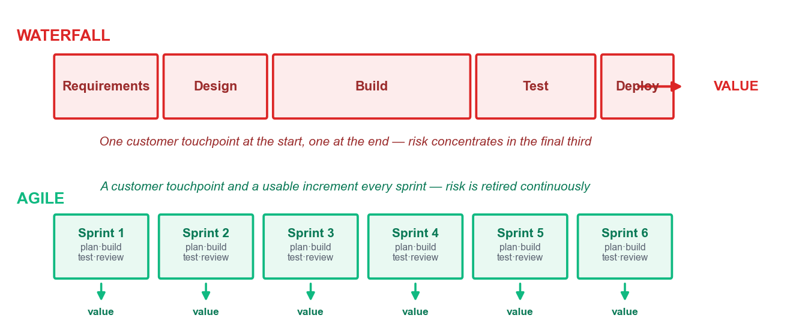

*Waterfall concentrates risk and value at the end; Agile releases both continuously.*

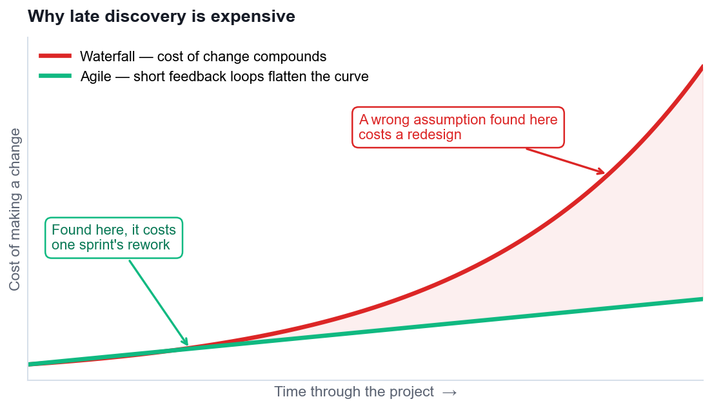

*The cost-of-change curve — the economic argument for short iterations.*

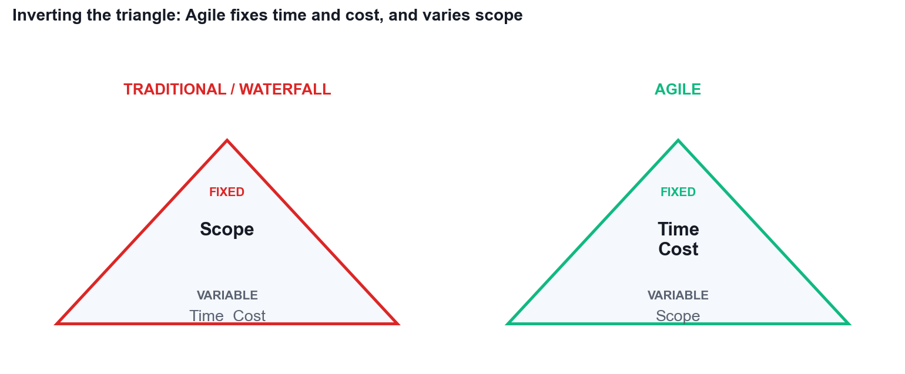

*Inverting the triangle: Agile fixes time and cost, and varies scope.*

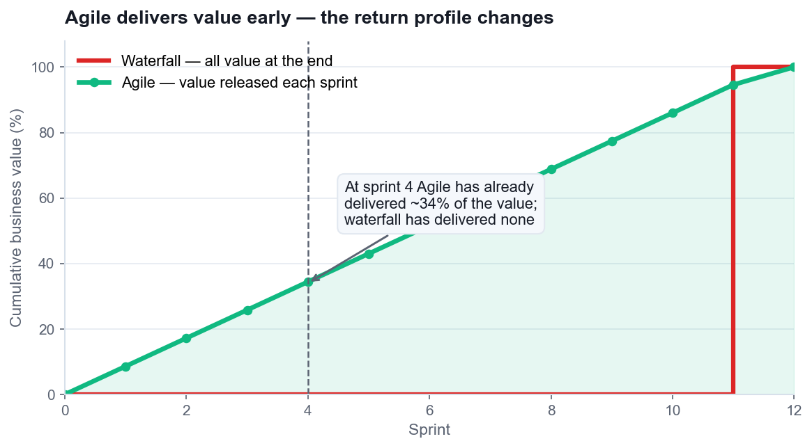

*Cumulative value delivered: Agile has released ~34% of value by sprint 4.*

### 3.3  Reference — Agile vs Waterfall

| Aspect | Waterfall / Traditional | Agile |
|---|---|---|
| Approach | Sequential phases, one pass | Iterative and incremental |
| Requirements | Fixed and signed off upfront | Emerge and are re-ordered continuously |
| Flexibility | Resists change after planning | Adapts throughout |
| Customer role | Consulted at the start and at UAT | Continuous collaboration |
| Delivery | One release at the end | A usable increment every sprint |
| Risk | Addressed upfront, realised late | Retired continuously |
| Documentation | Comprehensive by mandate | Barely sufficient, just in time |
| Team structure | Hierarchical, specialised roles | Self-organising, cross-functional |
| Best suited to | Stable scope, strict compliance, known technology | Evolving requirements, high novelty, need for fast feedback |

### 3.4  Reference — Choosing Your Approach

| If this is true of your project… | Lean towards |
|---|---|
| Requirements are genuinely fixed by regulation or contract | Waterfall |
| The customer cannot give feedback more than once | Waterfall |
| An increment cannot be built and changed cheaply (civil works, hardware tooling) | Waterfall or staged hybrid |
| Requirements are uncertain or will evolve | Agile |
| The work is novel and nobody has built it before | Agile |
| Early partial value is worth more than complete late value | Agile |
| You need to reduce the risk of building the wrong thing | Agile |
| Governance can fund incrementally and stop early | Agile |
| Some of the above, but not all | A deliberate hybrid — and say which parts are which |

## 4.  Topic 2 — Agile Essentials

Topic 2 is the essentials — the Agile Manifesto's four values and twelve principles, then the frameworks built on them: Scrum in depth, Lean, Kanban and XP. It closes with the part most courses skip: how to find support for Agile inside a real organisation, and how to handle the resistance you will certainly meet.

| Learning outcome | TSC coverage | Activities in this topic |
|---|---|---|
| LO2 | K4, K6, K7, A1, A3 | Activity 3, Activity 4 |

### 4.1  Key Concepts

- The Agile Manifesto (2001) holds 4 values and 12 principles. Each value is a preference, not a prohibition — 'we value X over Y' means both matter, X matters more when they conflict.
- Value 1 — Individuals and interactions over processes and tools: projects are undertaken by people, problems are solved by people, and no tool rescues a team that will not talk.
- Value 2 — Working software over comprehensive documentation: deliver something that works, and keep documents barely sufficient, just in time and for a reason.
- Value 3 — Customer collaboration over contract negotiation: manage change rather than suppress it, and build a shared, written definition of 'done'.
- Value 4 — Responding to change over following a plan: in high-change environments, energy spent defending the original plan is energy taken from delivering value.
- The 12 principles operationalise the values — early and continuous delivery, welcoming late change, short timescales, daily business-developer collaboration, motivated individuals, face-to-face conversation, working software as the measure of progress, sustainable pace, technical excellence, simplicity, self-organising teams, and regular reflection.
- Scrum is the most widely adopted framework (roughly 63% of Agile teams): 3 accountabilities, 3 artefacts and 5 events, all built on empiricism — transparency, inspection and adaptation.
- Scrum accountabilities: the Product Owner owns value and the backlog order; the Scrum Master owns the process and removes impediments as a servant leader; the Developers own how the work gets done.
- Scrum artefacts: the Product Backlog (ordered, refined, never finished), the Sprint Backlog (the Sprint Goal plus the selected items and the plan), and the Increment (usable, meeting the Definition of Done).
- Scrum events: Sprint Planning (what and how), the Daily Scrum (15 minutes, re-plan the next 24 hours), the Sprint Review (inspect the increment with stakeholders), the Sprint Retrospective (inspect the process), and the Sprint itself as the container.
- Lean, from Toyota, targets the eight wastes and holds seven principles: eliminate waste, amplify learning, decide as late as possible, deliver fast, empower the team, build quality in, and optimise the whole.
- Kanban ('signboard') runs five practices: visualise the workflow, limit work in progress, manage flow, make process policies explicit, and improve collaboratively. WIP limits are the engine — they surface bottlenecks instead of hiding them.
- Little's Law ties it together: Cycle Time = Work in Progress ÷ Throughput. Halve WIP at constant throughput and you halve cycle time — this is why limiting WIP speeds delivery.
- Extreme Programming (XP) contributes five values (simplicity, communication, feedback, courage, respect) and engineering practices: TDD, pair programming, continuous integration, refactoring, collective code ownership, small releases and sustainable pace.
- Scrum vs Kanban vs Scrumban: Scrum suits teams of 5–9 with a cadence and a goal; Kanban suits continuous-flow and high-variability work such as support queues; Scrumban blends a Scrum cadence with Kanban WIP limits.
- Other methods worth knowing: DSDM/AgilePM (the APM-endorsed framework with feasibility, foundations, evolutionary development and deployment), Feature-Driven Development, Crystal, and SAFe/LeSS for scaling.
- Finding Agile support: map stakeholders and address each fear directly — sponsors fear failure, managers fear loss of control, teams fear exposure, and users fear losing features.
- Handling resistance: start with a willing pilot team, make the wins visible, use evolutionary rather than revolutionary change, train and coach, and never present Agile as a way to get more for less.

### 4.2  Figures for Topic 2

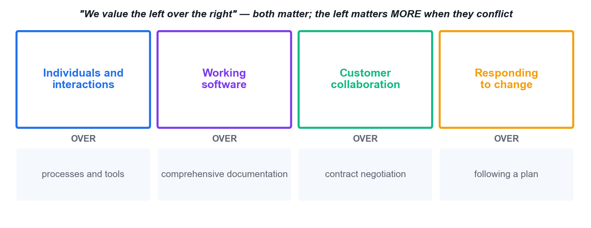

*The four values of the Agile Manifesto (2001).*

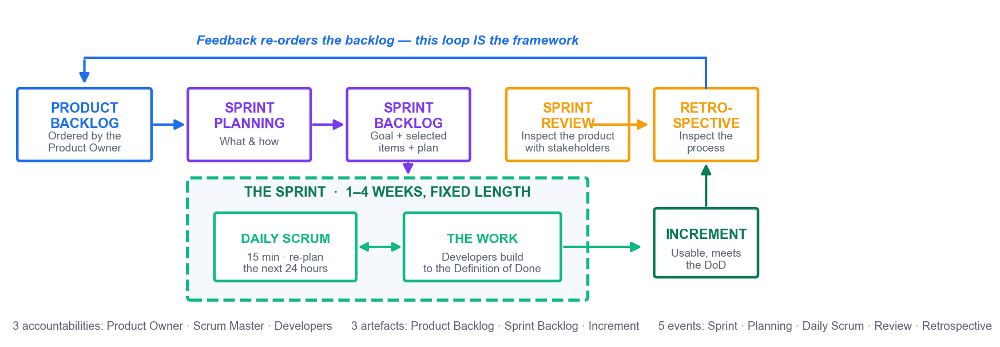

*The Scrum framework: 3 accountabilities, 3 artefacts, 5 events, one feedback loop.*

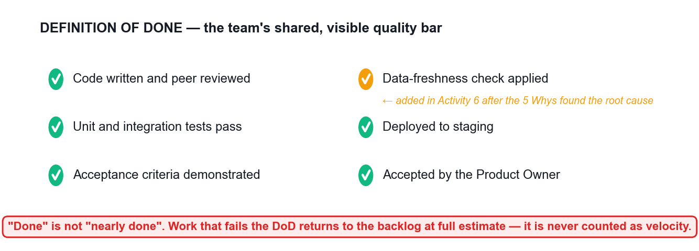

*A Definition of Done — the team's shared, visible and testable quality bar.*

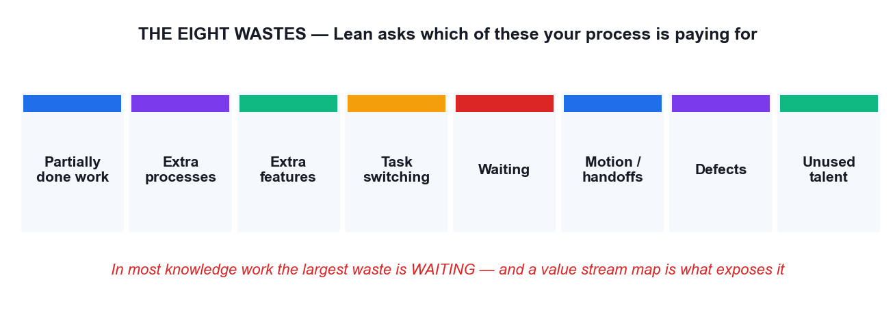

*The eight wastes that Lean targets.*

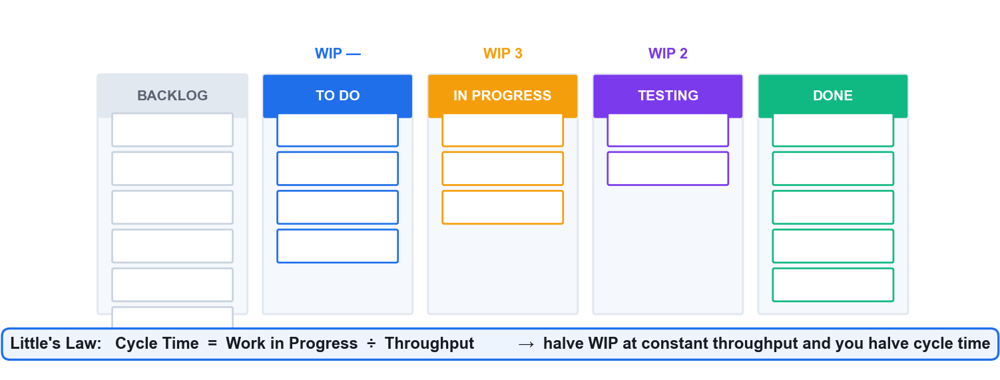

*A Kanban board with WIP limits, and Little's Law — the reason WIP limits work.*

### 4.3  Reference — The Twelve Principles of the Agile Manifesto

| # | Principle |
|---|---|
| 1 | Our highest priority is to satisfy the customer through early and continuous delivery of valuable software. |
| 2 | Welcome changing requirements, even late in development. Agile processes harness change for the customer's competitive advantage. |
| 3 | Deliver working software frequently, from a couple of weeks to a couple of months, with a preference to the shorter timescale. |
| 4 | Business people and developers must work together daily throughout the project. |
| 5 | Build projects around motivated individuals. Give them the environment and support they need, and trust them to get the job done. |
| 6 | The most efficient and effective method of conveying information to and within a development team is face-to-face conversation. |
| 7 | Working software is the primary measure of progress. |
| 8 | Agile processes promote sustainable development. The sponsors, developers and users should be able to maintain a constant pace indefinitely. |
| 9 | Continuous attention to technical excellence and good design enhances agility. |
| 10 | Simplicity — the art of maximizing the amount of work not done — is essential. |
| 11 | The best architectures, requirements and designs emerge from self-organizing teams. |
| 12 | At regular intervals, the team reflects on how to become more effective, then tunes and adjusts its behaviour accordingly. |

### 4.4  Reference — Scrum at a Glance

| Element | Who / what | Purpose |
|---|---|---|
| Product Owner | One person | Owns value and the ORDER of the product backlog. Accepts or rejects each increment. |
| Scrum Master | One person | Owns the process. Servant leader; removes impediments; coaches the team. |
| Developers | Typically 3–9 people | Own HOW the work is done and how much enters the sprint. |
| Product Backlog | Artefact | The ordered list of everything known to be needed. Commitment: the Product Goal. |
| Sprint Backlog | Artefact | The selected items plus the plan. Commitment: the Sprint Goal. |
| Increment | Artefact | A usable, integrated slice. Commitment: the Definition of Done. |
| Sprint | Event (container) | Fixed length, 1–4 weeks. Does not change length between sprints. |
| Sprint Planning | Event, up to 8h for a 1-month sprint | Decide the Sprint Goal, what is selected and how it will be built. |
| Daily Scrum | Event, 15 minutes | The Developers re-plan the next 24 hours. |
| Sprint Review | Event | Inspect the increment with stakeholders and adapt the backlog. |
| Sprint Retrospective | Event | Inspect the process and commit to one or two improvements. |

### 4.5  Reference — Scrum vs Kanban vs Scrumban

| Dimension | Scrum | Kanban | Scrumban |
|---|---|---|---|
| Cadence | Fixed sprints, 1–4 weeks | Continuous flow | Cadence plus WIP limits |
| Commitment | A Sprint Goal per sprint | Pull when capacity frees | Goal, flexible pull |
| Best for | Teams of 5–9 with a product goal | Support queues, high variability | Teams outgrowing strict Scrum |
| Roles | PO, SM, Developers | None prescribed | Usually keeps PO and SM |
| Key metrics | Velocity, sprint burndown | Cycle time, throughput, CFD | Both sets |
| Change mid-cycle | Protected by the Sprint Goal | Allowed any time within WIP limits | Allowed within WIP limits |

## 5.  Topic 3 — Agile Project Execution and Tracking

Topic 3 is where Agile becomes a week of actual work. You will build the team, set the vision, write and estimate stories, run a sprint, and read the five metrics that tell you what is really happening. Most importantly, you will learn to diagnose a delivery problem to a cause you can change.

| Learning outcome | TSC coverage | Activities in this topic |
|---|---|---|
| LO3 | K5, A4, A6, A7 | Activity 5, Activity 6, Activity 7, Activity 8 |

### 5.1  Key Concepts

- Team composition and formation models: high-performing Agile teams are cross-functional, self-organising, fewer than about 12 people, co-located or deliberately connected, with a shared vision and stable membership.
- Generalising specialists — members deep in one skill but capable across several — remove the single-point bottleneck that specialists create when work queues behind one person.
- Tuckman's model (forming, storming, norming, performing, adjourning) tells the leader which style to use: directing, then coaching, then supporting, then delegating. Adaptive leadership means matching style to team maturity.
- Shu-Ha-Ri and the Dreyfus model describe skill acquisition — obey the practice, adapt the practice, transcend the practice. New Agile teams should follow the framework before tailoring it.
- Servant leadership: shield the team from interruption, remove impediments, re-communicate the vision, and tap intrinsic motivation — autonomy, mastery and purpose — rather than relying on authority.
- Setting the vision: an Agile charter (who, what, why, when, where, how), a product vision statement, an elevator pitch, personas, wireframes and a shared Definition of Done all create the same picture in every head.
- Requirements as user stories: 'As a <role>, I want <goal>, so that <benefit>'. Stories carry value, are refined through conversation, and are confirmed by acceptance criteria — the three Cs: card, conversation, confirmation.
- INVEST tests a story: Independent, Negotiable, Valuable, Estimatable, Small, Testable. A story failing INVEST will fail in the sprint.
- Prioritisation techniques: MoSCoW (must, should, could, won't), dot voting, 100-point allocation, monopoly money, Kano analysis and weighted shortest job first. All must end in one ordered list.
- Relative estimation beats absolute estimation: story points capture complexity, effort and risk together. Planning poker with the Fibonacci sequence, affinity estimating and T-shirt sizing all defeat anchoring and the loudest-voice effect.
- Release and iteration planning: velocity (average points per sprint) converts an estimated backlog into a forecast range. 250 points at 18 points per sprint is about 14 sprints — a range, never a promise.
- Timeboxing and Parkinson's Law: the Daily Scrum is 15 minutes, a retrospective about 2 hours, a sprint 1–4 weeks. Work expands to fill the time available, so the box does the managing.
- The five Agile metrics that matter (Atlassian): sprint burndown (progress inside the sprint), epic/release burndown (progress across releases), velocity (forecasting capacity), the control chart (cycle and lead time), and the cumulative flow diagram (where the bottleneck is).
- Reading a cumulative flow diagram: a band widening vertically over time is a bottleneck at that status. Reading a burndown: a flat line means work is not being finished, not that nobody is busy.
- Lead time versus cycle time: lead time is the customer's whole wait; cycle time is the team's active portion. Throughput is the volume delivered per period. Excess WIP inflates all three.
- Metric anti-patterns: velocity is a forecasting tool, not a productivity target. Comparing velocity between teams, or rewarding it, produces point inflation and destroys the forecast.
- Assessing work performance: the Sprint Review inspects the product with stakeholders; the Retrospective inspects the process with the team; team self-assessments inspect the team itself.
- The retrospective in five stages: set the stage, gather data, generate insights, decide what to do, and close — about two hours for a two-week sprint. Insight techniques include 5 Whys, fishbone analysis, and dot voting.
- Continuous improvement through Kaizen and the Plan-Do-Check-Act cycle: small, frequent, team-owned improvements, each with a named owner and a SMART action carried into the next sprint backlog.
- Root-cause discipline: 5 Whys drills a single causal chain, the fishbone diagram spreads causes across categories, and a Pareto chart shows which few causes carry most of the pain. Use them together, then act on the top cause.
- Value stream mapping exposes waiting time between steps — usually far larger than the processing time — and gives the biggest, cheapest improvement available to most teams.
- Risk as anti-value: maintain a risk-adjusted backlog and a risk burndown chart. Expected monetary value = probability × impact, and risk work is scheduled as real backlog items, not as a side register.
- Technical and process debt: work skipped to go faster compounds into a slower team. Refactoring and cleanup must be funded inside the sprint, not deferred to a mythical later.
- Ownership and accountability (A7): the team commits to a Sprint Goal collectively, each member pulls their own work, updates the board honestly, and raises impediments the same day they appear.

### 5.2  Figures for Topic 3

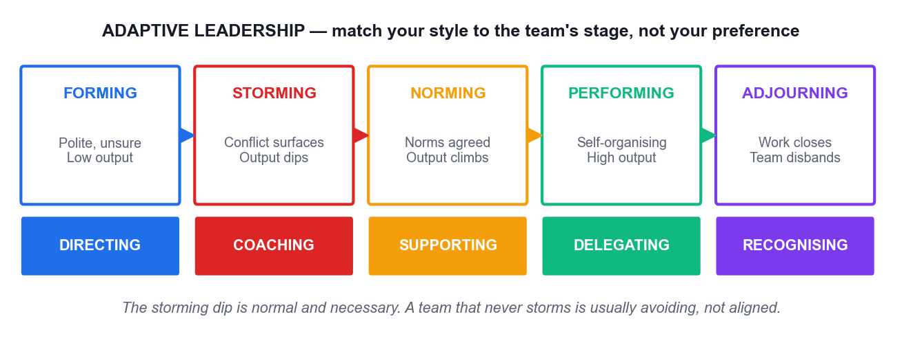

*Tuckman's stages, with the leadership style each stage needs.*

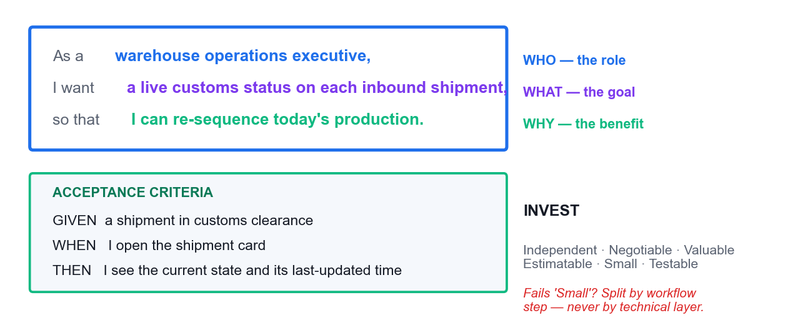

*The anatomy of a user story, its acceptance criteria and the INVEST test.*

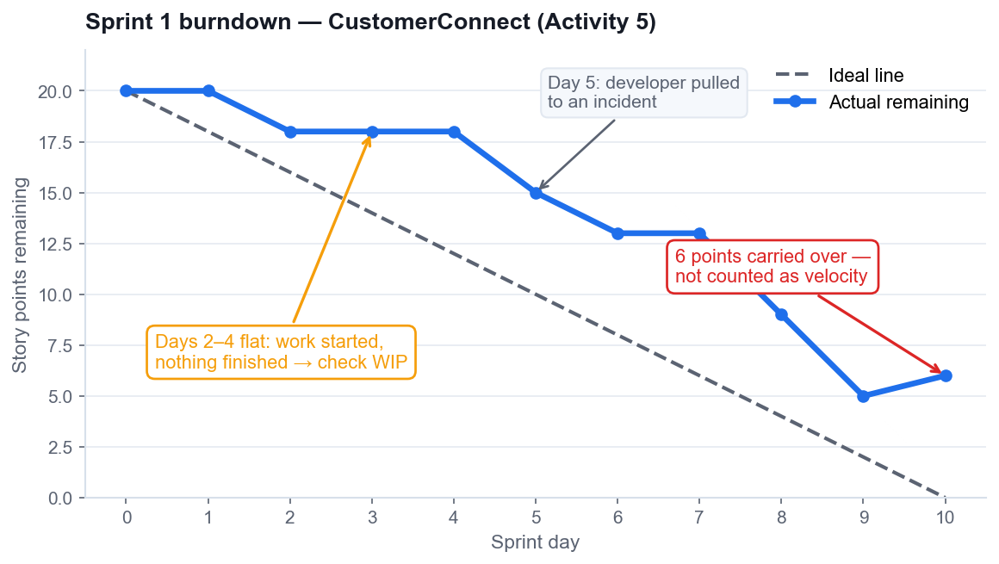

*Sprint burndown — the flat section and the carryover are the informative parts.*

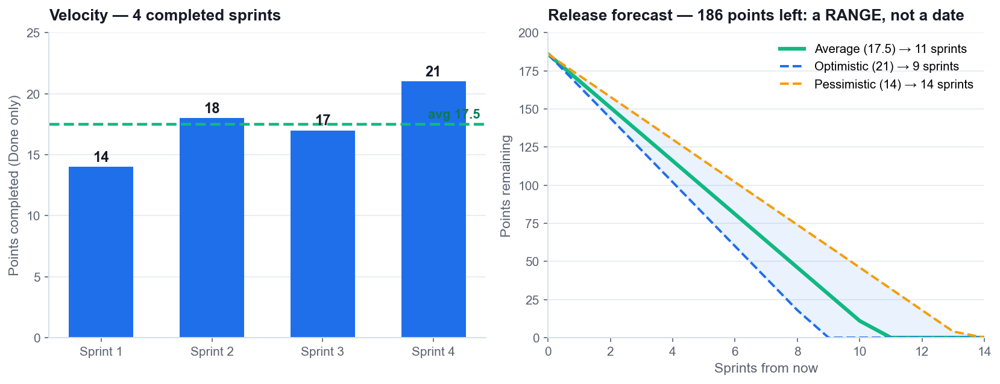

*Velocity, and a release forecast expressed as a range rather than a date.*

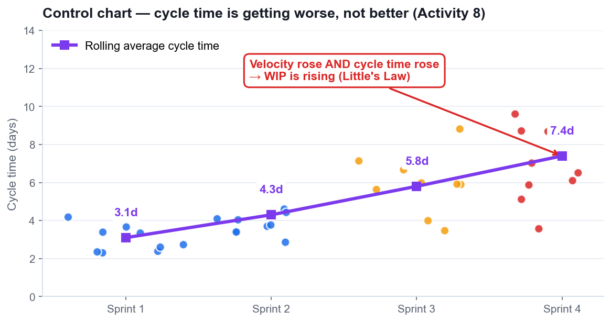

*Control chart — rising velocity together with rising cycle time means rising WIP.*

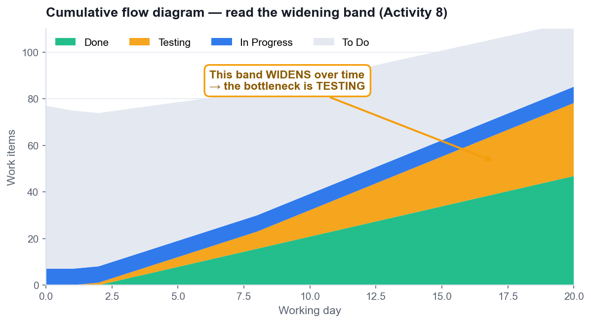

*Cumulative flow diagram — the widening band identifies the bottleneck.*

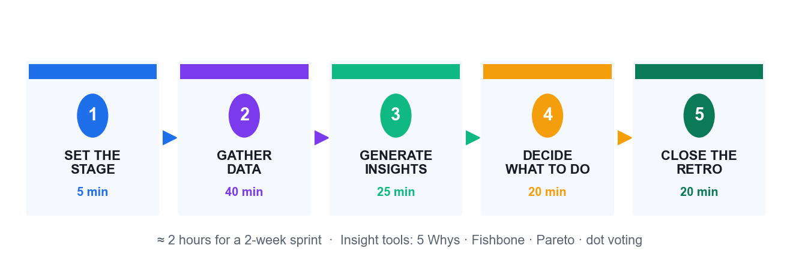

*The retrospective in five stages.*

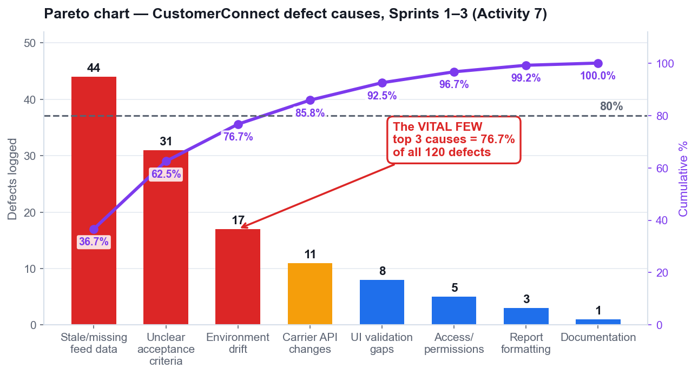

*Pareto analysis of the CustomerConnect defect data used in Activity 7.*

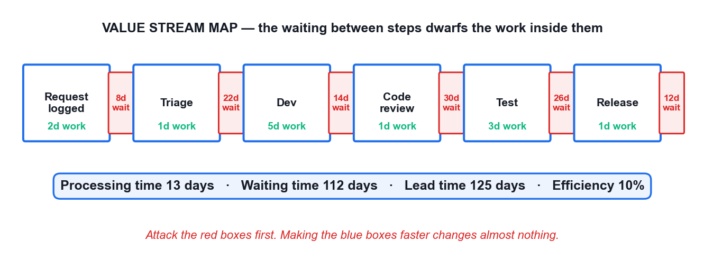

*A value stream map — 13 days of work inside 125 days of lead time.*

### 5.3  Reference — The Five Agile Metrics

| Metric | What it shows | How to read it | The anti-pattern |
|---|---|---|---|
| Sprint burndown | Points remaining in one sprint, day by day | A flat line means work is started but not finished — check WIP, not effort | Treating a late vertical drop as success; it means late integration |
| Epic / release burndown | Progress across a release or epic | Slope gives the completion trend; scope added shows as the line rising | Hiding scope growth by rebaselining silently |
| Velocity | Average points DONE per sprint | Use the slowest, average and fastest sprints to build a forecast range | Using it as a productivity target — this causes estimate inflation |
| Control chart | Cycle time and lead time per item, and the trend | Rising cycle time with rising velocity means WIP is rising | Celebrating velocity while cycle time worsens |
| Cumulative flow diagram | Count of items per status over time | A band widening vertically is a bottleneck at that status | Adding capacity to the busiest-looking column instead of the constraint |

### 5.4  Reference — Little's Law Worked

| Scenario | WIP | Throughput | Cycle time |
|---|---|---|---|
| The team starts everything | 30 items | 5 items/week | 6 weeks |
| The team halves WIP | 15 items | 5 items/week | 3 weeks |
| The team quarters WIP | 8 items | 5 items/week | 1.6 weeks |

> **READ THAT TABLE AGAIN** — Throughput is identical in all three rows. Only WIP changed, and cycle time fell with it. Cycle Time = WIP ÷ Throughput is arithmetic, not a management opinion — which is why limiting WIP is the single most reliable way to deliver faster.

### 5.5  Reference — Root-Cause Tools, and When to Use Each

| Tool | Use it when | It gives you |
|---|---|---|
| Fishbone (Ishikawa) | You need to see the WHOLE problem space across categories | A structured spread of candidate causes — breadth |
| Pareto chart | You have many causes and limited capacity | Which few causes carry most of the pain — priority |
| 5 Whys | You have chosen ONE problem and need the cause you can change | A single causal chain to a changeable root cause — depth |
| PDCA / Kaizen | You have a root cause and need it fixed | A funded, owned improvement carried into the next sprint |

> **THE SEQUENCE THAT WORKS** — Fishbone to see the whole space → Pareto to pick the few that matter → 5 Whys to reach the changeable cause → one SMART action with an owner and story points in the next sprint backlog. You will do exactly this in Activities 2, 6 and 7.

## 6.  Activities — Step-by-Step Instructions

This section carries the complete instructions for all eight activities. Work in your team, follow the numbered steps in order, and use the self-check at the end of each activity before you move on. Each activity also has its own folder in the course materials containing a worksheet and any data files you need.

> **WHY THE SLIDES DO NOT CARRY THESE STEPS** — The trainer's slides show the situation, the tool and the expected outcome. The detailed procedure lives here, in your Learner Guide, so you can work at your own pace during the activity and refer back to it after the course.

| # | Activity | Tool | Min | Topic | LO |
|---|---|---|---|---|---|
| 1 | Empathise with the Customer to Reframe a Failing Project | Design Thinking | 45 | Topic 1 | LO1 |
| 2 | Diagnose the Waterfall Failure with a Fishbone Analysis | Fishbone | 45 | Topic 1 | LO1 |
| 3 | Build the Product Backlog and Run Sprint 1 Planning | Scrum Board | 60 | Topic 2 | LO2 |
| 4 | Clarify Agile Role Accountability with a RACI Matrix | RACI Matrix | 45 | Topic 2 | LO2 |
| 5 | Execute Sprint 1 and Track It on the Scrum Board | Scrum Board | 60 | Topic 3 | LO3 |
| 6 | Run the Sprint Retrospective with 5 Whys Root-Cause Analysis | 5 Whys | 45 | Topic 3 | LO3 |
| 7 | Prioritise Defect Causes with a Pareto Chart | Pareto Chart | 45 | Topic 3 | LO3 |
| 8 | Forecast the Release from Velocity and Read the Agile Metrics | Scrum Board | 45 | Topic 3 | LO3 |

### 6.1  Activity 1 — Empathise with the Customer to Reframe a Failing Project

| Field | Detail |
|---|---|
| Topic | Topic 1 — Introduction to Agile Project Management |
| Learning outcome | LO1 |
| Objective | Analyse current and future customer needs and preferences using Design Thinking to reframe requirements around customer value (K2, A5). |
| Duration | 45 minutes |
| Tool | Design Thinking — https://alfredang.github.io/designthinking/ |
| Team size | 3–4 learners |
| Materials | Design Thinking tool (alfredang.github.io/designthinking), the HarbourFront case brief, team flip chart |
| Activity folder | activities/activity-01-*/ |

#### The situation

HarbourFront Logistics spent 11 months building the CustomerConnect portal from a signed-off 96-page requirements document. Six months after launch, only 3 of 24 features are used weekly. The top customer complaint to the call centre is still "where is my shipment right now?" — a question the portal was supposed to answer. You are the newly appointed Agile project lead. Before writing a single new requirement, you must understand the customer.

#### What you will do

Working in teams of 3–4 as the CustomerConnect project team, you use the Design Thinking tool to build an empathy map and a persona for Priya Menon, a warehouse operations executive at a HarbourFront customer who tracks 40–60 inbound shipments a week. You then reframe the original requirement statement into a customer-value problem statement and identify the three highest-value features to deliver first.

#### What you will produce

**A completed empathy map and persona for Priya Menon, a reframed problem statement, and a ranked list of the top 3 customer-value features with the reasoning for each.**

#### Step-by-step instructions

1. Open the Design Thinking tool at https://alfredang.github.io/designthinking/ and start a new canvas named 'CustomerConnect — Priya Menon'.
2. Read the HarbourFront case brief in the Learner Guide, Activity 1. Highlight every statement that is evidence about the customer, and ignore statements that are internal opinion.
3. In the EMPATHISE stage, complete the four quadrants for Priya. SAYS: 'I just need to know if it clears customs today.' THINKS: 'If I guess wrong I hold up the whole production line.' DOES: refreshes the portal, then calls the hotline anyway. FEELS: anxious, and not trusted with information.
4. Add the pains and gains. Pains: no real-time status, 6 clicks to reach a shipment, no alerting. Gains: one glance to confirm arrival, an alert before a delay affects production.
5. In the DEFINE stage, write the reframed problem statement in the form: 'Priya, a warehouse operations executive, needs a way to know the live customs and delivery status of her inbound shipments, because guessing wrong stops her production line.'
6. Compare your reframed statement with the original requirement: 'The system shall provide a shipment reporting module with configurable export formats.' Note in one sentence what the original optimised for instead of the customer.
7. In the IDEATE stage, generate at least 8 feature ideas that would satisfy the reframed statement. Do not evaluate while generating.
8. Rank the ideas by customer value and select the top 3. For each, write one sentence stating the benefit to Priya, not the feature description.
9. Export or screenshot the canvas and paste it into your team's Activity 1 worksheet. Nominate one member to present the reframed statement in 90 seconds.

#### Self-check — are you done?

> **DONE WHEN** — Your reframed problem statement names a specific user, a specific need and a specific consequence — and contains no solution or technology. Your top 3 features each state a customer benefit. If any 'feature' is a module name or a format, it is still a requirement, not a value statement — rewrite it.

#### Debrief — what this activity proves

- The original project delivered exactly what was signed off, and still failed. Signed-off scope is not the same as delivered value.
- Empathising took 45 minutes. It would have changed 11 months of build.
- This is K2 in practice: analysing current and future customer needs is a repeatable method, not an intuition.

#### Worksheet

*Record your team's output for Activity 1 below, or in the worksheet file in the activity folder.*

**Worksheet:** record your team's output in the activity folder worksheet.

### 6.2  Activity 2 — Diagnose the Waterfall Failure with a Fishbone Analysis

| Field | Detail |
|---|---|
| Topic | Topic 1 — Introduction to Agile Project Management |
| Learning outcome | LO1 |
| Objective | Analyse the current business operating landscape and diagnose why a waterfall delivery failed, using cause-and-effect analysis (K1, K3, A2). |
| Duration | 45 minutes |
| Tool | Fishbone — https://alfredang.github.io/fishbone/ |
| Team size | 3–4 learners |
| Materials | Fishbone tool (alfredang.github.io/fishbone), the HarbourFront project post-mortem data in the Learner Guide |
| Activity folder | activities/activity-02-*/ |

#### The situation

The HarbourFront management committee wants to know why CustomerConnect was 4 months late and 62% unused before it approves any new funding. The programme director's explanation was "the team underestimated". The CEO is not satisfied with that answer and has asked your team for a structured diagnosis by Friday.

#### What you will do

Your team uses the Fishbone (Ishikawa) tool to analyse the problem statement 'CustomerConnect delivered late and mostly unused'. You populate six cause categories, identify which causes are structural to the waterfall approach rather than failures of individual effort, and mark which ones an Agile approach would actually address. You then write a one-page recommendation to the committee.

#### What you will produce

**A completed fishbone diagram with 6 categories and at least 18 causes, each tagged as structural or behavioural, plus a one-page recommendation identifying which causes Agile addresses and which it does not.**

#### Step-by-step instructions

1. Open the Fishbone tool at https://alfredang.github.io/fishbone/ and enter the problem statement 'CustomerConnect delivered 4 months late and 62% of features unused' as the effect.
2. Create six cause categories: Process, People, Requirements, Governance, Technology, and Customer Involvement.
3. Under Requirements, add causes from the post-mortem data: scope frozen at month 1, 96-page document signed off before any prototype, no change route except a formal variation, 41 change requests rejected.
4. Under Process, add: single integration at month 9, no working software until month 8, testing compressed into the final 6 weeks, defects found after the design was locked.
5. Under Customer Involvement, add: customer consulted at requirements and at UAT only, an 8-month gap with no customer contact, no customer in the room when priorities were set.
6. Under Governance, add: stage-gate approvals rewarded documents over working output, progress reported as percent-complete of tasks, no mechanism to stop or redirect funding mid-project.
7. Under People and Technology, add the remaining causes: one specialist per skill creating queues, no shared definition of done, an unproven integration platform chosen at month 2 and unvalidated until month 9.
8. Review every cause and tag it S (structural — caused by the delivery approach itself) or B (behavioural — caused by how people acted). Count each.
9. For each structural cause, name the specific Agile practice that addresses it: frozen scope → product backlog with continuous reordering; late integration → potentially shippable increment each sprint; customer gap → sprint review every 2 weeks; percent-complete reporting → working software as the measure of progress.
10. Identify at least two causes that Agile does NOT fix on its own — for example an unproven platform still needs a technical spike, and a governance model that cannot fund incrementally must itself be changed.
11. Export the diagram and draft the one-page recommendation to the committee: the diagnosis, the structural/behavioural split, and what must change beyond the delivery method.

#### Self-check — are you done?

> **DONE WHEN** — Your diagram carries at least 18 causes across all 6 categories, every cause is tagged S or B, and each structural cause is paired with a named Agile practice. Your recommendation honestly identifies at least two causes Agile will not fix — a diagnosis that concludes 'Agile solves everything' has not been done properly.

#### Debrief — what this activity proves

- Most causes tag as structural. The team did not fail; the approach concentrated all risk at the end.
- This is why the cost-of-change curve matters: every one of these causes became expensive because it was discovered late.
- K3 in practice: organisational policies and governance had to change too. Adopting Agile inside a stage-gate funding model produces theatre, not agility.

#### Worksheet

*Record your team's output for Activity 2 below, or in the worksheet file in the activity folder.*

**Worksheet:** record your team's output in the activity folder worksheet.

### 6.3  Activity 3 — Build the Product Backlog and Run Sprint 1 Planning

| Field | Detail |
|---|---|
| Topic | Topic 2 — Agile Essentials |
| Learning outcome | LO2 |
| Objective | Implement Agile practices by converting business needs into an ordered product backlog and a committed sprint backlog with a sprint goal (K6, K7, A3). |
| Duration | 60 minutes |
| Tool | Scrum Board — https://alfredang.github.io/scrum/ |
| Team size | 3–4 learners |
| Materials | Scrum tool (alfredang.github.io/scrum), Fibonacci planning-poker cards, the Activity 1 persona and top-3 features |
| Activity folder | activities/activity-03-*/ |

#### The situation

HarbourFront's committee has approved a restart: 6 sprints of 2 weeks, one team of 7 people, and a hard demonstration to the top 5 customers in 12 weeks. Nothing from the old 96-page document is carried over unexamined. You are the team, with your trainer as Product Owner. Sprint 1 planning starts now.

#### What you will do

Your team writes user stories from the Activity 1 customer insight, applies INVEST, estimates with planning poker using the Fibonacci sequence, orders the backlog with MoSCoW, then loads Sprint 1 to a capacity of 20 story points and writes a single sprint goal. You use the Scrum tool to hold the backlog and the sprint board.

#### What you will produce

**A product backlog of at least 12 estimated user stories in priority order, a Sprint 1 backlog of about 20 points, one written sprint goal, and a Definition of Done agreed by the whole team.**

#### Step-by-step instructions

1. Open the Scrum tool at https://alfredang.github.io/scrum/ and create a new project named 'CustomerConnect Restart'.
2. Write your first three user stories from the Activity 1 top-3 features, in the form 'As a <role>, I want <goal>, so that <benefit>'. Example: 'As a warehouse operations executive, I want a live customs status on each inbound shipment, so that I can decide whether to re-sequence today's production.'
3. Add acceptance criteria to each story using Given/When/Then. For the live-status story: 'Given a shipment in customs clearance, when I open the shipment card, then I see the current customs state and the timestamp it was last updated.'
4. Expand the backlog to at least 12 stories. Cover the customer-facing needs, then add the enabling stories the team needs — user authentication, the carrier data feed, and an alerting service.
5. Test every story against INVEST. Any story that cannot be finished inside one 2-week sprint fails 'Small' — split it by workflow step or by data type, never by technical layer.
6. Run planning poker on each story. Deal the Fibonacci cards (1, 2, 3, 5, 8, 13, 21), reveal simultaneously, and have the highest and lowest estimators explain before re-voting. Record the agreed points in the tool.
7. Any story estimated at 13 or 21 points must be split before it can enter a sprint — a number that large means the team does not yet understand it.
8. Order the full backlog using MoSCoW. Be strict: if more than 60% of your backlog is 'Must have', you have not prioritised, you have relabelled.
9. Write ONE sprint goal for Sprint 1 stating the business outcome, not a list of stories. Example: 'A customer can see the live status of one shipment end to end.'
10. Pull stories from the top of the ordered backlog into Sprint 1 until you reach about 20 points. Stop at the capacity line even if the next story is attractive.
11. Agree the team's Definition of Done as a checklist — coded, peer reviewed, tested, deployed to staging, and accepted by the Product Owner. Record it in the tool where the whole team can see it.
12. Confirm that every story in Sprint 1 serves the sprint goal. Remove any story that does not, however small it is.

#### Self-check — are you done?

> **DONE WHEN** — Sprint 1 holds about 20 points, every story in it serves the one written sprint goal, no story exceeds 8 points, every story has Given/When/Then acceptance criteria, and the Definition of Done is visible to the whole team. A sprint whose stories serve four unrelated goals is a task list, not a sprint.

#### Debrief — what this activity proves

- The sprint goal is the single most skipped artefact and the one that makes the sprint reviewable.
- Splitting by workflow step keeps every slice demonstrable; splitting by technical layer produces a sprint with nothing to show.
- This is A3 in practice: implementing Agile practices to reduce waste — an ordered backlog stops the team building the 62% nobody used.

#### Worksheet

*Record your team's output for Activity 3 below, or in the worksheet file in the activity folder.*

**Worksheet:** record your team's output in the activity folder worksheet.

### 6.4  Activity 4 — Clarify Agile Role Accountability with a RACI Matrix

| Field | Detail |
|---|---|
| Topic | Topic 2 — Agile Essentials |
| Learning outcome | LO2 |
| Objective | Share information across teams and organise work in alignment with priorities by making Agile role accountability explicit (K5, A1, A2). |
| Duration | 45 minutes |
| Tool | RACI Matrix — https://alfredang.github.io/raci/ |
| Team size | 3–4 learners |
| Materials | RACI tool (alfredang.github.io/raci), the CustomerConnect role brief in the Learner Guide |
| Activity folder | activities/activity-04-*/ |

#### The situation

Two weeks into the restart, CustomerConnect has stalled in a familiar way. The old programme director is still approving every story change. The Scrum Master has been asked to produce a weekly percent-complete report. Two developers have escalated that they receive conflicting priorities from the Product Owner and from the operations manager. Nobody is behaving badly — the accountabilities were never made explicit.

#### What you will do

Your team uses the RACI tool to map 12 real project decisions and activities against the five roles in play. You then find the anti-patterns — activities with two Accountables, activities with none, and roles consulted on everything — and produce the corrected matrix that resolves the conflicting-priorities escalation.

#### What you will produce

**A completed RACI matrix covering 12 activities across 5 roles, a list of the anti-patterns found, and the corrected matrix with the specific change that resolves the developers' escalation.**

#### Step-by-step instructions

1. Open the RACI tool at https://alfredang.github.io/raci/ and create a matrix named 'CustomerConnect Restart — Accountability'.
2. Add the five roles as columns: Product Owner, Scrum Master, Developers, Programme Director, Operations Manager (customer proxy).
3. Add these 12 activities as rows: order the product backlog; write acceptance criteria; estimate stories; select stories into the sprint; decide how the work is built; change the sprint scope mid-sprint; remove impediments; report progress to the committee; accept a completed story; approve the release to production; decide the Definition of Done; run the retrospective.
4. Assign R, A, C and I for each activity. Apply the Scrum accountabilities honestly: the Product Owner is Accountable for backlog order and for accepting stories; the Developers are Accountable for how the work is built and for selecting how much enters the sprint.
5. Assign 'change the sprint scope mid-sprint' carefully. In Scrum the Developers own the sprint content once the sprint starts; the Product Owner negotiates, and does not overrule.
6. Now audit your matrix. Rule 1: exactly one A per row. Find every row with two A's or none.
7. Rule 2: a role marked C on nearly every row is a bottleneck. Check whether the Programme Director is Consulted on everything — and decide which of those should become I.
8. Rule 3: R with no A is orphaned work, and A with no R is a manager with nobody doing the work. Fix both.
9. Trace the developers' escalation through your matrix. Two roles giving priorities means two A's on 'order the product backlog'. Resolve it by making the Product Owner the single A and the Operations Manager a C.
10. Change 'report progress to the committee' from a percent-complete report to a sprint review demonstration, and reassign the R accordingly.
11. Export the corrected matrix. Write two sentences on which single change would most reduce the team's confusion, and why.

#### Self-check — are you done?

> **DONE WHEN** — Every one of the 12 rows has exactly one A. No role is C on more than about half the rows. The developers' conflicting-priorities escalation is traceable to a specific duplicate A in your first draft, and your corrected matrix removes it.

#### Debrief — what this activity proves

- Most Agile 'transformation failures' are accountability failures wearing an Agile label.
- The single A rule is what makes a Product Owner viable. Two Accountables for backlog order guarantees the escalation you just resolved.
- This is A1 and A2 in practice: sharing information across teams to bridge operational barriers, and organising work in line with actual priorities.

#### Worksheet

*Record your team's output for Activity 4 below, or in the worksheet file in the activity folder.*

**Worksheet:** record your team's output in the activity folder worksheet.

### 6.5  Activity 5 — Execute Sprint 1 and Track It on the Scrum Board

| Field | Detail |
|---|---|
| Topic | Topic 3 — Agile Project Execution and Tracking |
| Learning outcome | LO3 |
| Objective | Measure progress against targets on a regular basis by executing a sprint on a live board and reading the burndown (K5, A4, A7). |
| Duration | 60 minutes |
| Tool | Scrum Board — https://alfredang.github.io/scrum/ |
| Team size | 3–4 learners |
| Materials | Scrum tool (alfredang.github.io/scrum), the Sprint 1 backlog from Activity 3, the trainer's impediment cards |
| Activity folder | activities/activity-05-*/ |

#### The situation

Sprint 1 of the CustomerConnect restart runs for 10 working days with a committed 20 points. Your team will simulate all 10 days in compressed time, holding a daily stand-up each 'day', moving cards, and hitting three real impediments the trainer injects: the carrier data feed returns stale timestamps on Day 3, a developer is pulled onto a production incident on Day 5, and the Product Owner requests a new story mid-sprint on Day 7.

#### What you will do

Using your Sprint 1 backlog from Activity 3, your team runs the sprint day by day on the Scrum board. Each simulated day you hold a 3-minute stand-up answering the three questions, move cards across To Do / In Progress / Testing / Done, respect a WIP limit of 3 in progress, log impediments, and update the burndown. You handle each injected impediment as the framework prescribes.

#### What you will produce

**A completed 10-day sprint board, a burndown chart with all 10 data points, an impediment log with the resolution of each of the 3 injections, and the actual velocity achieved.**

#### Step-by-step instructions

1. Open your 'CustomerConnect Restart' project in the Scrum tool and switch to the sprint board. Confirm Sprint 1 holds the stories and points you committed in Activity 3.
2. Set a WIP limit of 3 on the In Progress column. This is the constraint that makes the simulation behave like a real team.
3. Record the sprint's starting total in points and plot Day 0 on the burndown. Draw the ideal line from the starting total to zero at Day 10.
4. Day 1–2: each team member pulls ONE story, moves it to In Progress, and works it. Hold a 3-minute stand-up: what did I finish, what am I taking next, what is blocking me. Move only genuinely finished work to Done — finished means it meets the Definition of Done.
5. Day 3 — impediment 1: the carrier feed returns stale timestamps. Log it as an impediment, not as a story. Decide as a team whether the affected story can still meet the Definition of Done; if it cannot, move it back and record why. The Scrum Master owns removing this, and the sprint goal does not change.
6. Update the burndown each day. When you plot Day 3, notice the line flattening — a flat burndown means work is being started but not finished, which is the signal to check your WIP.
7. Day 5 — impediment 2: a developer is pulled to a production incident for two days. Recalculate remaining capacity, and decide as a team which committed story is at risk. Tell the Product Owner the same day — surfacing it on Day 9 is the failure, not the capacity loss itself.
8. Day 7 — impediment 3: the Product Owner asks for a new 5-point story mid-sprint. Apply the framework: the Developers own the sprint content. Either the new story displaces an equal-sized committed story by agreement, or it goes to the top of the product backlog for Sprint 2. Record which you chose and why.
9. Day 8–10: drive the remaining work to Done. Any story not meeting the Definition of Done at Day 10 returns to the product backlog at its original estimate — never count it as partially done.
10. Compute your actual velocity: the total points of stories that fully met the Definition of Done. Record it in the tool, and record the points that carried over separately.
11. Hold a 10-minute Sprint Review. Demonstrate the increment against the sprint goal you wrote in Activity 3, and have another team act as the customer and give feedback.
12. Export the board, the burndown and the impediment log into your Activity 5 worksheet.

#### Self-check — are you done?

> **DONE WHEN** — Your burndown has 10 plotted points and an ideal line. Your velocity counts only fully-Done stories, with carryover recorded separately. All 3 impediments are logged with a decision and a rationale. If your burndown is a straight diagonal line, you have plotted the plan, not the sprint — plot what actually happened.

#### Debrief — what this activity proves

- The flat burndown on Day 3 is the most valuable thing on the chart. It is an early warning, and it only appears if the board is honest.
- Carryover counted as velocity destroys forecasting. Velocity must mean 'Done', or every forecast built on it is fiction.
- The Day 7 injection is the real test of Agile discipline: welcoming change does not mean accepting unbounded scope inside a committed sprint.

#### Worksheet

*Record your team's output for Activity 5 below, or in the worksheet file in the activity folder.*

**Worksheet:** record your team's output in the activity folder worksheet.

### 6.6  Activity 6 — Run the Sprint Retrospective with 5 Whys Root-Cause Analysis

| Field | Detail |
|---|---|
| Topic | Topic 3 — Agile Project Execution and Tracking |
| Learning outcome | LO3 |
| Objective | Assess work performance and quality to ensure continuous improvement, drilling to the root cause of a delivery problem (A6, A7). |
| Duration | 45 minutes |
| Tool | 5 Whys — https://alfredang.github.io/5whys/ |
| Team size | 3–4 learners |
| Materials | 5 Whys tool (alfredang.github.io/5whys), your Activity 5 impediment log and burndown |
| Activity folder | activities/activity-06-*/ |

#### The situation

Sprint 1 finished 6 of 20 committed points short. In the review, one customer noted that the shipment status feature 'works but shows yesterday's data'. In the retrospective, the team's first instinct is to blame the carrier data feed. The Scrum Master pushes for a real root cause, because the same class of problem appeared twice in the old waterfall project.

#### What you will do

Your team runs a full retrospective in the five stages, using the 5 Whys tool on the single highest-impact problem from Sprint 1. You drive past the first plausible answer to a root cause the team can actually act on, then convert it into one SMART action with a named owner that enters the Sprint 2 backlog as a real item.

#### What you will produce

**A completed 5 Whys chain of at least 5 levels reaching an actionable root cause, plus one SMART improvement action with a named owner, a measure, and a place in the Sprint 2 backlog.**

#### Step-by-step instructions

1. Set the stage (5 minutes). Each member states in one word how the sprint felt. The Scrum Master states the one rule: we examine the process, not the people.
2. Gather data (10 minutes). Put the facts on the table from Activity 5: 14 of 20 points Done, the Day 3 stale-timestamp impediment, the Day 5 capacity loss, the Day 7 scope request, and the customer's review comment.
3. Choose ONE problem to analyse — the one with the largest impact on the sprint goal. Here it is 'the shipment status feature displays stale data'. Resist analysing all five problems at once.
4. Open the 5 Whys tool at https://alfredang.github.io/5whys/ and enter that problem statement.
5. Why 1: Why does it display stale data? Because the carrier feed timestamps were not refreshed within the display window.
6. Why 2: Why was that not caught before the review? Because the story's acceptance criteria did not specify a maximum data age.
7. Why 3: Why did the acceptance criteria omit it? Because the team wrote criteria for what the screen shows, not for how fresh the data must be.
8. Why 4: Why was freshness not treated as a requirement? Because the Definition of Done has no data-quality check, so nobody was required to consider it.
9. Why 5: Why does the Definition of Done omit data quality? Because it was copied from the previous project's checklist and never revisited for a real-time product. This is the root cause — and it is a process cause the team owns and can change.
10. Sanity-check the chain by reading it backwards: because the DoD was copied and not revisited, freshness was never required, so criteria omitted it, so it was not tested, so stale data shipped. If the reverse reading breaks, a link is wrong — fix it.
11. Generate insights: note that this same root cause would also have produced the two data problems in the old waterfall project. A root cause that explains prior failures too is usually the real one.
12. Decide what to do. Write ONE SMART action: 'The Scrum Master will facilitate a 30-minute DoD revision in Sprint 2 Day 1, adding a data-freshness check with a maximum age stated per data source; done when the revised DoD is agreed by all 7 members and visible on the board.'
13. Add the action to the Sprint 2 backlog as a real item with points. An improvement action with no capacity allocated is a wish, not a commitment.
14. Close the retrospective with a Plus/Delta round: one thing to keep, one thing to change about the retrospective itself.

#### Self-check — are you done?

> **DONE WHEN** — Your chain reaches a process or system cause the team can change, not a person and not an external party. Reading it backwards with 'because' holds together at every link. Your SMART action has an owner, a measure and points in the Sprint 2 backlog. If your root cause is 'the carrier's fault', you stopped at Why 1.

#### Debrief — what this activity proves

- Stopping at 'the carrier feed was stale' would have produced a ticket. Reaching the copied Definition of Done produced a systemic fix.
- A root cause you cannot act on is not a root cause — it is an excuse with a diagram.
- This is A6 in practice: assessing work performance and quality to drive continuous improvement, with PDCA closing the loop in the next sprint.

#### Worksheet

*Record your team's output for Activity 6 below, or in the worksheet file in the activity folder.*

**Worksheet:** record your team's output in the activity folder worksheet.

### 6.7  Activity 7 — Prioritise Defect Causes with a Pareto Chart

| Field | Detail |
|---|---|
| Topic | Topic 3 — Agile Project Execution and Tracking |
| Learning outcome | LO3 |
| Objective | Measure progress against targets and reduce waste and defects by identifying the few causes driving most of the failures (A3, A4, A6). |
| Duration | 45 minutes |
| Tool | Pareto Chart — https://alfredang.github.io/paretochart/ |
| Team size | 3–4 learners |
| Materials | Pareto tool (alfredang.github.io/paretochart), the 120-defect dataset in the Learner Guide Activity 7 |
| Activity folder | activities/activity-07-*/ |

#### The situation

Three sprints in, CustomerConnect has accumulated 120 logged defects. The team has capacity to attack roughly two root causes in Sprint 4, and the operations manager wants all 120 fixed. The Scrum Master has categorised every defect by cause and wants the team to decide with data rather than by whoever complains loudest.

#### What you will do

Your team loads the 120-defect dataset into the Pareto tool, builds the ranked bar chart with the cumulative percentage line, identifies the vital few causes crossing the 80% threshold, and converts that finding into a Sprint 4 commitment with a measurable target. You then confront the trade-off with the operations manager.

#### What you will produce

**A completed Pareto chart of 8 defect categories with a cumulative line, the identified vital few, and a Sprint 4 improvement commitment with a numeric target and the projected defect reduction.**

#### Step-by-step instructions

1. Open the Pareto tool at https://alfredang.github.io/paretochart/ and create a chart named 'CustomerConnect Defect Causes — Sprints 1–3'.
2. Enter the 8 defect categories and counts from the Learner Guide dataset: Stale or missing feed data 44; Unclear acceptance criteria 31; Environment and configuration drift 17; Carrier API contract changes 11; UI validation gaps 8; Access and permission errors 5; Report formatting 3; Documentation errors 1.
3. Confirm the total is 120. If the tool reports a different total, one category was entered twice — reconcile before reading anything from the chart.
4. Let the tool sort the categories descending and plot the cumulative percentage line. Never read a Pareto chart that is not sorted.
5. Read the cumulative line and identify where it crosses 80%. Stale/missing feed data alone is 36.7%; adding unclear acceptance criteria reaches 62.5%; adding environment drift reaches 76.7%; adding API contract changes reaches 85.8%.
6. Name the vital few: the top 3 causes account for 76.7% of all defects, and the top 4 for 85.8%. The remaining 4 categories together account for just 14.2%.
7. Connect this to Activity 6. Your 5 Whys root cause — a Definition of Done with no data-quality check — sits underneath the two largest bars, which together are 62.5% of all defects. The same fix attacks both.
8. Set a measurable Sprint 4 target: fix the top 2 causes at the root and reduce total defect inflow by at least 50% in Sprint 4, measured as defects logged per sprint.
9. Prepare the answer to the operations manager. State it in his terms: fixing 2 of 8 causes addresses 62.5% of defects, and fixing all 8 would cost roughly 3 sprints of capacity to eliminate a final 14.2%. Recommend the trade-off explicitly.
10. Export the chart and record the target in your Sprint 4 planning notes so the next retrospective can verify whether the reduction was actually achieved.

#### Self-check — are you done?

> **DONE WHEN** — Your chart is sorted descending, the cumulative line reaches 100%, and your vital few are justified by the crossing point rather than chosen by intuition. Your Sprint 4 target is numeric and verifiable. If your recommendation is 'fix everything', you have not used the chart to make a decision.

#### Debrief — what this activity proves

- Pareto turns 'everything is broken' into 'two things are broken and they cause most of it'.
- Activities 6 and 7 combine: 5 Whys finds the cause, Pareto proves it is the one worth fixing first.
- This is A3 and A4 in practice: reducing waste and defects, and measuring against a defined target rather than an impression.

#### Dataset — CustomerConnect defect causes, Sprints 1–3

Enter these 8 categories into the Pareto tool. The total must come to 120.

| Defect cause category | Count |
|---|---|
| Stale or missing feed data | 44 |
| Unclear acceptance criteria | 31 |
| Environment and configuration drift | 17 |
| Carrier API contract changes | 11 |
| UI validation gaps | 8 |
| Access and permission errors | 5 |
| Report formatting | 3 |
| Documentation errors | 1 |
| TOTAL | 120 |

| Cumulative check | Cumulative % |
|---|---|
| Stale/missing feed data | 36.7% |
| + Unclear acceptance criteria | 62.5% |
| + Environment drift | 76.7% |
| + Carrier API changes | 85.8% |

#### Worksheet

*Record your team's output for Activity 7 below, or in the worksheet file in the activity folder.*

**Worksheet:** record your team's output in the activity folder worksheet.

### 6.8  Activity 8 — Forecast the Release from Velocity and Read the Agile Metrics

| Field | Detail |
|---|---|
| Topic | Topic 3 — Agile Project Execution and Tracking |
| Learning outcome | LO3 |
| Objective | Measure progress against targets for defined business outcomes and forecast delivery from empirical data (A4, A6, A7). |
| Duration | 45 minutes |
| Tool | Scrum Board — https://alfredang.github.io/scrum/ |
| Team size | 3–4 learners |
| Materials | Scrum tool (alfredang.github.io/scrum), the velocity data and the supplied CFD/control chart in Learner Guide Activity 8 |
| Activity folder | activities/activity-08-*/ |

#### The situation

The HarbourFront committee meets on Friday and wants one answer: when will the remaining CustomerConnect scope be delivered? The team has completed 4 sprints with velocities of 14, 18, 17 and 21 points. There are 186 points left in the backlog. The programme director wants a single date. The operations manager has separately asked why the support queue keeps growing despite the team 'going faster'.

#### What you will do

Your team computes average velocity, builds a forecast range rather than a single date, plots a release burndown, and interprets a supplied cumulative flow diagram and control chart to locate the bottleneck behind the growing support queue. You then write the committee answer — a range with its assumptions stated.

#### What you will produce

**A velocity-based forecast range in sprints and calendar dates, a release burndown, a written interpretation of the CFD and control chart naming the bottleneck, and a one-paragraph answer to the committee.**

#### Step-by-step instructions

1. Record the 4 sprint velocities in the Scrum tool: 14, 18, 17, 21. Compute the average (17.5) and note the range (14 to 21).
2. Compute the forecast three ways. Average: 186 ÷ 17.5 = 10.6, so 11 sprints. Pessimistic (slowest): 186 ÷ 14 = 13.3, so 14 sprints. Optimistic (fastest): 186 ÷ 21 = 8.9, so 9 sprints.
3. Convert to calendar dates at 2 weeks per sprint: roughly 18 to 28 weeks, with 22 weeks as the most likely. Present the range, never the single number.
4. Write the assumptions the forecast depends on: the team stays stable, the backlog does not grow, the 186 points are estimated at the same scale, and no sprint is lost to other work. State them with the range — a forecast without assumptions is a promise.
5. Plot the release burndown: 186 points remaining, dropping by the average velocity each sprint, to zero. Add the pessimistic and optimistic lines to show the cone of uncertainty narrowing as sprints complete.
6. Now open the supplied cumulative flow diagram in the Learner Guide. Identify which band is widening vertically over time — the Testing band. A widening band is a bottleneck at that status.
7. Confirm it against the control chart: cycle time has risen from 3.1 days in Sprint 1 to 7.4 days in Sprint 4, while lead time has risen faster still. Work is entering faster than it is leaving Testing.
8. Explain the operations manager's growing support queue with Little's Law: Cycle Time = WIP ÷ Throughput. Velocity rose because more work was started, while throughput past the Testing constraint did not — so WIP and cycle time both rose. The team looks faster and delivers to the customer more slowly.
9. Recommend the counter-intuitive action: lower the WIP limit on Testing and stop starting new stories until Testing clears. Rising velocity with rising cycle time is a warning, not an achievement.
10. State plainly why velocity must not be a target. If the committee rewards velocity, the team inflates estimates, the forecast breaks, and the Testing bottleneck gets worse.
11. Write the one-paragraph committee answer: the range, the most likely date, the stated assumptions, the identified bottleneck, and the single action you are taking about it.

#### Self-check — are you done?

> **DONE WHEN** — Your answer is a range with assumptions, not a single date. You identify Testing as the bottleneck from the CFD and confirm it with the control chart. You explain the growing queue with Little's Law. If your recommendation is 'increase velocity', re-read the control chart — that is what caused the problem.

#### Debrief — what this activity proves

- Five metrics, one story: burndown for the sprint, release burndown for the release, velocity for the forecast, control chart for cycle time, CFD for the bottleneck.
- Velocity up and cycle time up at the same time always means WIP is up. Little's Law is not optional arithmetic.
- This is A4 in practice: measuring progress against targets for defined business outcomes — and being honest with the committee about uncertainty.

#### Dataset — velocity and remaining backlog

| Input | Value |
|---|---|
| Sprint 1 velocity | 14 points |
| Sprint 2 velocity | 18 points |
| Sprint 3 velocity | 17 points |
| Sprint 4 velocity | 21 points |
| Average velocity | 17.5 points |
| Points remaining in the backlog | 186 points |
| Sprint length | 2 weeks |

#### Dataset — cycle time by sprint (for the control chart)

| Sprint | Average cycle time |
|---|---|
| Sprint 1 | 3.1 days |
| Sprint 2 | 4.3 days |
| Sprint 3 | 5.8 days |
| Sprint 4 | 7.4 days |

#### Expected answer — check your working

| Calculation | Result |
|---|---|
| Average forecast: 186 ÷ 17.5 | 10.6 → 11 sprints (~22 weeks) |
| Pessimistic: 186 ÷ 14 | 13.3 → 14 sprints (~28 weeks) |
| Optimistic: 186 ÷ 21 | 8.9 → 9 sprints (~18 weeks) |
| Answer to the committee | 18–28 weeks, most likely ~22 weeks, assuming a stable team and no backlog growth |
| Bottleneck from the CFD | Testing — its band widens vertically over time |
| Confirmation from the control chart | Cycle time rose 3.1 → 7.4 days while velocity rose |
| Cause | WIP rose faster than throughput past the Testing constraint (Little's Law) |
| Recommended action | Lower the WIP limit on Testing; stop starting new stories until Testing clears |

#### Worksheet

*Record your team's output for Activity 8 below, or in the worksheet file in the activity folder.*

**Worksheet:** record your team's output in the activity folder worksheet.

## 7.  Glossary

| Term | Meaning |
|---|---|
| Acceptance criteria | The conditions a user story must satisfy to be accepted, usually written Given / When / Then. |
| Agile Manifesto | The 2001 statement of 4 values and 12 principles from which the Agile frameworks derive. agilemanifesto.org |
| Burndown chart | A chart of work remaining over time, within a sprint or across a release. |
| Cadence | The fixed rhythm of a team's events — for example a 2-week sprint. |
| Control chart | A chart of cycle time or lead time per work item, showing the trend. |
| Cumulative flow diagram (CFD) | A stacked area chart of item counts per status over time; a widening band identifies a bottleneck. |
| Cycle time | How long an item takes to move through the team's active process. |
| Daily Scrum | A 15-minute daily event in which the Developers re-plan the next 24 hours. |
| Definition of Done (DoD) | The team's shared, testable standard for calling work complete. Applies to every item. |
| DSDM / AgilePM | The Agile framework endorsed by APM (UK), with feasibility, foundations, evolutionary development and deployment phases. |
| Epic | A large body of work that is broken down into multiple user stories. |
| Impediment | Anything blocking the team's progress that the team cannot remove itself; the Scrum Master owns its removal. |
| Increment | A usable, integrated slice of product that meets the Definition of Done. |
| INVEST | A test for a good user story: Independent, Negotiable, Valuable, Estimatable, Small, Testable. |
| Kaizen | Continuous improvement through small, frequent, team-owned changes. |
| Kanban | A flow-based method: visualise the workflow, limit WIP, manage flow, make policies explicit, improve collaboratively. |
| Lead time | The customer's total wait, from request to delivery. Includes cycle time plus all queueing. |
| Lean | A Toyota-derived approach focused on eliminating waste and maximising value. |
| Little's Law | Cycle Time = Work in Progress ÷ Throughput. The reason limiting WIP speeds delivery. |
| MoSCoW | A prioritisation method: Must have, Should have, Could have, Won't have this time. |
| MVP (Minimum Viable Product) | The smallest release that delivers real value and produces genuine learning. |
| PDCA | Plan-Do-Check-Act — Deming's improvement cycle, used to carry a retrospective action to completion. |
| Planning poker | Relative estimation in which the team reveals Fibonacci estimates simultaneously to avoid anchoring. |
| Product Backlog | The single ordered list of everything known to be needed in the product. |
| Product Owner | The one person accountable for the value of the product and the order of the Product Backlog. |
| Refinement (grooming) | The ongoing activity of adding detail, estimates and order to backlog items. |
| Retrospective | The event at the end of a sprint in which the team inspects its process and commits to improvement. |
| Scrum | The most widely used Agile framework: 3 accountabilities, 3 artefacts, 5 events, built on empiricism. |
| Scrum Master | The person accountable for the team's process, coaching and impediment removal. A servant leader. |
| Scrumban | A hybrid that keeps a Scrum cadence while adding Kanban WIP limits. |
| Servant leadership | Leading by enabling — removing obstacles and providing what the team needs, rather than directing. |
| Spike | A timeboxed investigation used to reduce a specific technical or risk unknown. |
| Sprint | A fixed-length container of 1–4 weeks in which all Scrum events occur. |
| Sprint Backlog | The Sprint Goal, the selected items, and the plan for delivering them. |
| Sprint Goal | The single objective for a sprint. The commitment carried by the Sprint Backlog. |
| Story point | A relative unit combining complexity, effort and risk. |
| Technical debt | Work deferred to move faster now, which makes later work slower until repaid. |
| Throughput | The number of items completed per unit of time. |
| Timebox | A fixed maximum duration for an activity. Work is adjusted to fit the box. |
| TSC | Technical Skills and Competencies — the Singapore Skills Framework unit this course maps to (ICT-BIN-4038-1.1). |
| User story | A requirement expressed from the user's perspective: As a <role>, I want <goal>, so that <benefit>. |
| Velocity | The average story points completed per sprint. A forecasting input, never a target. |
| VUCA | Volatility, uncertainty, complexity and ambiguity — the conditions Agile is designed for. |
| Waterfall | A sequential delivery approach in which each phase completes before the next begins. |
| WIP (Work in Progress) | Work started but not finished. High WIP inflates cycle time and hides bottlenecks. |
| XP (Extreme Programming) | An Agile method contributing TDD, pair programming, continuous integration and refactoring. |

## 8.  Further Reading and Sources

The content of this guide draws on the following public sources, in addition to the course's own material:

| Source | Link | What it contributes |
|---|---|---|
| Agile Manifesto | https://agilemanifesto.org/ | The original four values and twelve principles. |
| Atlassian — Agile Project Management | https://www.atlassian.com/agile/project-management | Practical guidance on Agile delivery, and the five agile metrics used in Topic 3. |
| APM (Association for Project Management) — Agile Project Management | https://www.apm.org.uk/resources/find-a-resource/agile-project-management/ | The UK professional body's definition, benefits, principles and governance guidance. |
| Coursera — What Is Agile? A Beginner's Guide | https://www.coursera.org/articles/what-is-agile-a-beginners-guide | The Agile lifecycle, methodology comparison and framework adoption figures. |
| Rasmussen — What Is Agile Project Management? | https://www.rasmussen.edu/degrees/business/blog/what-is-agile-project-management/ | Agile in non-software business contexts, with company examples. |
| Adobe Business — Agile methodology: frameworks and best practices | https://business.adobe.com/blog/basics/agile | Agile applied to marketing and creative teams; scaling and team-size guidance. |
| GeeksforGeeks — Agile Project Management | https://www.geeksforgeeks.org/software-engineering/agile-project-management/ | The five-phase APM lifecycle, advantages, disadvantages and comparison tables. |

### 8.1  Recommended Next Courses

- WSQ - Fast-Track Innovations with Agile Design Thinking and Generative AI (GenAI)
- WSQ - Design Thinking Course for Businesses
- WSQ - Effective Project Management for Small Projects
- WSQ - Innovative Problem Solving with Generative AI (GenAI)
- WSQ - Mastering Agile Project Management for IT Projects

### 8.2  Support

| Channel | Detail |
|---|---|
| Email | enquiry@tertiaryinfotech.com |
| Telephone | +65 6100 0613 |
| Website | www.tertiarycourses.com.sg |
| LMS / TMS | https://lms-tms.tertiaryinfotech.com |

